# 🩺 Heart Disease Risk AI

**Real-time cardiovascular risk prediction achieving 97% sensitivity with <200ms inference — powering emergency triage, preventive cardiology, and enterprise-scale decision support.**

*By Ridwan Oladipo, MD | Clinical AI Architect*

---

[](https://huggingface.co/spaces/dr-ridwanoladipo/cardio-ai)
[](https://huggingface.co/spaces/dr-ridwanoladipo/cardio-ai-api)  
[](#-deployment-options)    
[](https://github.com/dr-ridwanoladipo/cardio-ai)

> **Clinically aligned Heart-AI system built with physician-led modeling, guideline-integrated decision support, and full AWS production MLOps.**

---
## 🎯 Executive Summary
Heart disease remains the leading global cause of death, where rapid risk stratification directly impacts survival in emergency and preventive settings.  
This system delivers **cardiovascular risk prediction in <200ms** with **97% sensitivity**, **SHAP explainability**, and guideline-aligned recommendations—deployed on **AWS Fargate** and ready for hospital EHR integration, telemedicine workflows, and enterprise clinical decision support.

---
## 📊 Performance at a Glance

| Metric | Value | Clinical Meaning |
|:--|:--|:--|
| **Sensitivity** | **0.97** | Captures nearly all true heart disease cases |
| **Specificity** | **0.71** | Balanced false-positive rate for safe triage |
| **ROC-AUC** | **0.91** | Strong overall discriminative power |
| **PPV** | **0.80** | High reliability when predicting disease |
| **NPV** | **0.95** | Very low risk of missing true negatives |


> Clinically tuned for **safety-first medicine** — prioritizing early detection and minimizing missed disease.

---
## 🌐 Deployment Options
- **Live Demos**: Instant access via HuggingFace (UI + API)
- **Production (On-Demand)**: Fully deployed on AWS ECS Fargate at *cardio.mednexai.com* — **available by request**  
>⚡ **AWS Production**: cardio.mednexai.com — CI/CD-enabled, <10 minutes cold-start (cost-optimized)

---
## 💼 Business Impact
- **Risk Stratification Automation**: Replaces manual ASCVD/Framingham scoring, saving 8,000+ physician-hours annually at a 500-bed hospital
- **Preventive Cardiology**: Identifies high-risk patients before acute events, reducing avoidable ED admissions and downstream costs
- **EHR & Telemedicine Ready**: API-first design enables plug-and-play deployment into Epic, Cerner, and remote-care platforms
---

## 🏗️ Medical Workflow Architecture

```mermaid
graph LR

%% ------------------------
%% Linear Clinical → AI Flow
%% ------------------------

A[Patient Inputs\nAge, Symptoms, Vitals, ECG] 
    --> B[Streamlit Clinical UI]

B --> C[FastAPI Backend\nValidation and Safety Checks]

C --> D[XGBoost Model\nFast Inference]

D --> E[Risk Prediction\nLow, Moderate, High]

E --> F[SHAP Explainability\nKey Feature Contributions]

F --> G[Clinical Recommendations\nGuideline-Aligned]

%% ------------------------
%% AI Pipeline Group
%% ------------------------
subgraph "AI Pipeline"
    D
    E
    F
end

%% ------------------------
%% Clinical Output Group
%% ------------------------
subgraph "Clinical Output"
    G
    H[Clinician Review]
    I[Treatment or Follow-up Planning]
end

G --> H
H --> I

%% ------------------------
%% Light Styling (same as your brain tumor project)
%% ------------------------
style A fill:#e1f5fe
style D fill:#fff3e0
style G fill:#f3e5f5
```



---

## 📖 Development Pipeline
- **[EDA & Feature Engineering](https://github.com/dr-ridwanoladipo/cardio-ai/blob/master/notebooks/01_data_eda_features.ipynb)** — clinical variable analysis · risk-factor encoding · feature selection
- **[Training & Evaluation](https://github.com/dr-ridwanoladipo/cardio-ai/blob/master/notebooks/02_model_train_eval.ipynb)** — XGBoost/ensemble tuning · calibration · AUC/Recall/Precision reporting

---

## 🎬 Interactive Features

### **Clinical Interface**
- Real-time cardiovascular risk scoring (<200ms)
- Color-coded risk gauge with confidence analysis  
- SHAP waterfall + clinical explanations  
- Guideline-aligned recommendations (AHA/ACC + NCEP)  
- Population percentile visualization  

### **API Integration**
Production-grade FastAPI endpoints with full documentation:

```bash
curl -X POST "https://dr-ridwanoladipo-cardio-ai-api.hf.space/predict" \
     -H "Content-Type: application/json" \
     -d '{"age":63,"sex":1,"cp":0,"trestbps":145,"chol":233,"fbs":1,"restecg":0,"thalach":150,"exang":0,"oldpeak":2.3,"slope":0,"ca":0,"thal":1}'

# Interactive docs:
https://dr-ridwanoladipo-cardio-ai-api.hf.space/docs
```

---
## 🎨 Visual Showcase

### **Risk Assessment Dashboard**
**High-risk patient example:**  


**Low-risk patient example:**  


### **SHAP Explainability**


### **Clinical Decision Support**


___

## 🏗️ Technical Architecture & MLOps
- **Model**: XGBoost optimized with Optuna (50+ trials) + SMOTE class balancing for minority-case sensitivity  
- **Dataset**: Cleveland Heart Disease (303 patients, UCI) - standard cardiology ML benchmark with clinically validated features
- **Feature Engineering**: Age stratification, AHA/ACC blood-pressure categories, NCEP cholesterol risk levels, ECG-related interactions  
- **Robustness**: 97% sensitivity maintained across demographic subgroups with clinical plausibility checks  

**Production Stack**: XGBoost • FastAPI • Streamlit • AWS ECS Fargate • Docker • GitHub Actions • CloudWatch  
**CI/CD**: Automated ECS deployments with health checks, rollback, and zero-downtime (~5 min git-push → production)  
**Explainability**: SHAP top-feature attribution • Guideline-aligned clinical interpretation • Population percentile benchmarking  

---

## 🧪 Clinical Validation & Compliance
- Stratified train-val-test split with cross-validation, class-balanced evaluation, and demographic subgroup analysis
- All medical decisions should be made in consultation with qualified healthcare providers

---

## 👨‍⚕️ About the Developer
**Ridwan Oladipo, MD — Medical Data Scientist · Clinical AI Architect**  
Builds **end-to-end medical AI systems** — from deep learning & LLM pipelines (NLP, generative, agentic AI) to **full AWS MLOps deployment** (FastAPI, Docker, ECS Fargate, Bedrock, SageMaker).  
Delivered **7+ production-grade systems** across cardiology, radiology, pharmacology, and multimodal diagnostics, unifying clinical expertise with advanced machine learning and cloud engineering.

**Professional Training:** Stanford University (AI in Healthcare) • Duke University (MLOps) • Harvard University (ML & CS50) • Johns Hopkins University (Generative AI) • University of Oxford (Agentic AI)

### Connect & Collaborate
[](https://mednexai.com)
[](https://linkedin.com/in/drridwanoladipoai)
[](mailto:dr.ridwan.oladipo@gmail.com)

**Open to:** Medical Data Scientist · Clinical AI Architect · Applied ML/MLOps Engineer  
**Collaboration:** Hospitals, AI startups, research labs, telemedicine companies, and engineering teams building real-world medical AI products.


